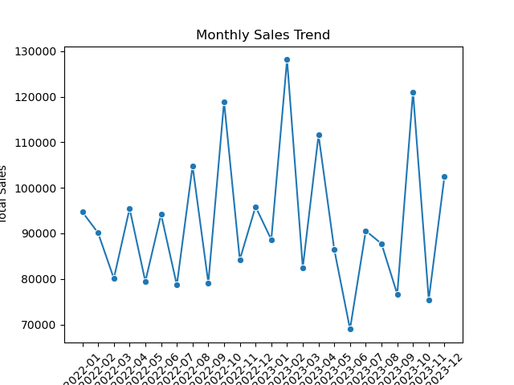
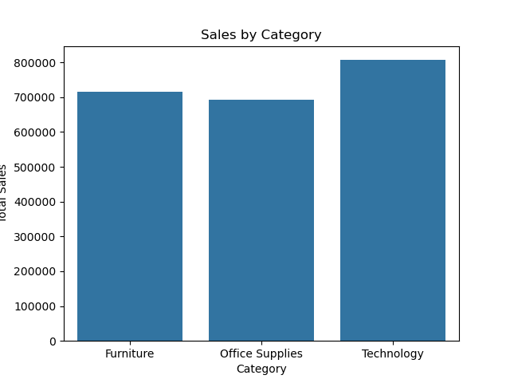
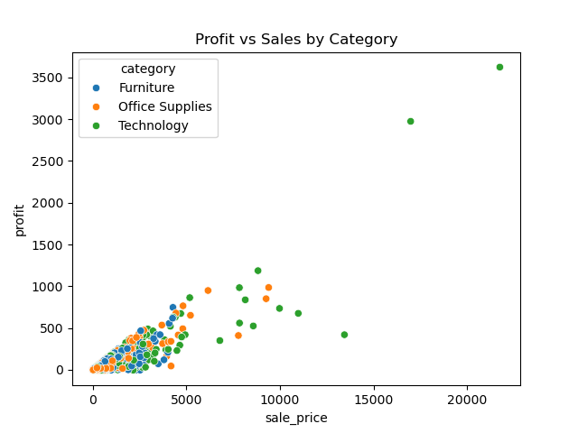

# Retail Sales Data Analysis (Python + SQL)

## Project Overview

This project presents an end-to-end analysis of a retail sales dataset to uncover meaningful business insights such as product performance, regional profitability, and sales trends.

The workflow includes data cleaning, feature engineering, SQL-based analysis, and data visualization.

---

## Tools & Technologies

- Python
- Pandas
- MySQL
- SQL
- SQLAlchemy
- Matplotlib
- Seaborn

---

## Project Workflow

1. Data Extraction using Kaggle API  
2. Data Cleaning and Transformation using Pandas  
3. Feature Engineering (discount, sale price, profit)  
4. Data Loading into MySQL  
5. SQL Queries for Business Analysis  
6. Data Visualization using Python  

---

## Dataset Description

The dataset contains retail order data with key attributes such as:

- Order ID  
- Product ID  
- Category & Sub-category  
- Region  
- Sales & Profit  
- Quantity  
- Order Date  

---

## Key Business Questions

The project answers the following analytical questions:

- Which products generate the highest revenue?  
- Which region contributes the most profit?  
- Which category has the highest sales?  
- What are the top 5 products in each region?  
- Which sub-category shows the highest growth (year-over-year)?  
- How do monthly sales trends vary over time?  

---

## Visualizations

### Monthly Sales Trend

---

### Sales by Category

---

### Profit by Region

---

### Top 10 Products by Sales

---

### Profit vs Sales by Category

---

## Key Insights

- Technology category generates the highest overall revenue  
- West region contributes the highest profit  
- A small set of products drive a large portion of total sales  
- Sales patterns show variation across different months  

---

## Project Structure
Retail-Sales-Analysis
│
├── data
│ └── orders.csv

├── notebooks
│ └── data_analysis.ipynb

├── sql
│ └── analysis_queries.sql

├── images
│ ├── monthly_sales_trend.png
│ ├── sales_by_category.png
│ ├── profit_by_region.png
│ ├── top_10_products_sales.png
│ └── profit_vs_sales.png

└── README.md

---

## Conclusion

This project demonstrates the complete workflow of a data analysis pipeline, from raw data processing to extracting actionable insights using SQL and Python.

---
